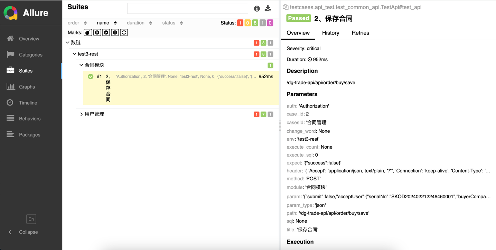
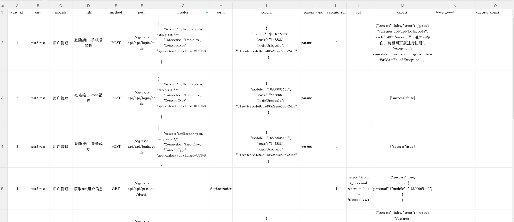

# auto-test


`auto-test` 是一个基于Python的自动化测试框架，集成了Requests进行HTTP请求处理，利用Pytest进行测试用例编写与执行，以及Allure用于生成详细的测试报告，旨在提高Web服务接口测试的效率与质量。
## 项目说明
本项目在实现过程中，把整个项目拆分成请求方法封装、HTTP接口封装、关键字封装、测试用例等模块。

首先利用Python把HTTP接口封装成Python接口，接着把这些Python接口组装成一个个的关键字，再把关键字组装成测试用例，而测试数据则通过Excel文件进行统一管理，然后再通过Pytest测试执行器来运行这些脚本，并结合Allure输出测试报告。
## 技术栈

- **编程语言**: Python
- **HTTP请求库**: Requests
- **测试框架**: Pytest
- **测试报告**: Allure

## 环境要求
- Python 3.12
- allure-pytest==2.13.5
- jsonpath==0.82.2
- openpyxl==3.1.2
- PyMySQL==1.1.0
- pytest==8.2.0
- PyYAML==6.0.1
- redis==5.0.4
- requests==2.31.0
- playwright==1.43.0
## 安装与配置

首先，下载项目源码后，在根目录下找到 ```requirements.txt``` 文件，然后通过 pip 工具安装 requirements.txt 依赖，命令行中执行命令：

```
pip3 install -r requirements.txt
```
## 快速开始
1. **运行测试**:
```
python run.py
```
因为run.py文件中，有调用allure serve 的命令，无需单独执行allure serve 命令。在命令行执行命令：```python run.py``` 运行用例后，会自动生成测试报告，测试报告文件在 ```reports``` 目录下。
### 测试报告效果展示

1. 报告状态（下图status对应的颜色）：
 - Failed（失败）：测试用例未能通过所有的验证条件。
 - Broken（中断）：测试执行过程中出现了意外情况，导致测试无法继续执行。
 - Passed（通过）：测试用例成功通过了所有的验证条件。
 - Skipped（跳过）：测试用例因为某些条件不符合而被跳过执行。
 - Unknown（未知）：测试结果无法确定或未知。



## 项目结构
- common ====>> 各种工具类：操作mysql、redis、excel等工具或中间件
- config ====>> 配置文件
- core ====>> requests请求方法封装、关键字返回结果类
- data ====>> 测试数据文件管理
- locator ====>> UI元素定位文件
- logs ====>> 日志文件夹
- page ====>> UI页面元素操作封装
- reports ====>> 测试报告文件夹
- requirements.txt ====>> 相关依赖包文件
- testcases ====>> 测试用例

## 接口测试数据结构

接口测试用例数据文件说明
- case_id：用例编号
- env：执行用例环境
- module：模块名称
- title: 用例标题
- path: 请求路径
- method: 请求方法：POST、GET、PUT、DELETE
- header: 请求头 有特殊的请求头可以设置
- auth: 是否需要认证：需要认证设置Authorization即可
- param: 请求参数
- param_type: 请求参数类型：params、json
- execute_sql: 是否执行sql：0-不执行，1-执行
- sql: 执行的sql
- expect: 预期结果
- change_word: 请求参数中需要替换的字符
- execute_count: 执行次数




